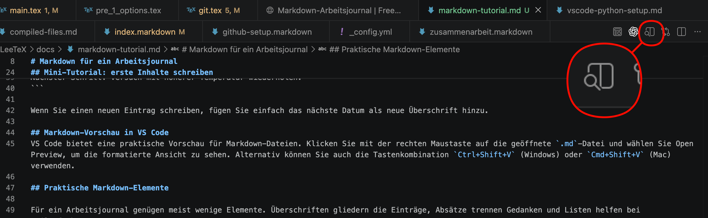

# Markdown für ein Arbeitsjournal

Diese Seite zeigt, wie Sie in VS Code eine einfache `.md`-Datei anlegen und als Arbeitsjournal verwenden können. Ein Arbeitsjournal hilft Ihnen, Arbeitsschritte, Ideen, Probleme und Lösungen sauber festzuhalten.

## Was ist Markdown?

Markdown ist eine einfache Schreibweise für formatierte Texte. Sie schreiben normalen Text und setzen mit wenigen Zeichen Überschriften, Listen, Links oder Codeblöcke. Gerade für ein Arbeitsjournal ist das praktisch, weil Sie sich auf den Inhalt konzentrieren können und nicht auf eine komplizierte Oberfläche.

## Neue `.md`-Datei in VS Code erstellen

Öffnen Sie Ihren Arbeitsordner in VS Code. Klicken Sie links im Explorer mit der rechten Maustaste in den Ordner, wählen Sie New File und geben Sie als Namen zum Beispiel `arbeitsjournal.md` ein.

Falls Sie lieber über das Menü arbeiten, können Sie auch oben über File > New File eine neue Datei anlegen und sie anschliessend mit `.md` speichern.

Sobald die Datei gespeichert ist, erkennt VS Code automatisch, dass es sich um eine Markdown-Datei handelt.

## Mini-Tutorial: erste Inhalte schreiben

Ein Arbeitsjournal braucht keine komplizierte Struktur. Bewährt hat sich ein Eintrag pro Arbeitstag oder pro Sitzung mit Datum, erledigten Arbeiten und nächstem Schritt.

So kann ein Eintrag aussehen:

```md
# Arbeitsjournal

## 2026-05-12

Heute habe ich Versuch A durchgeführt.
Die Temperatur betrug 40 °C.
Das Ergebnis war unbrauchbar.

Nächster Schritt: Versuch mit höherer Temperatur wiederholen.
```

Wenn Sie einen neuen Eintrag schreiben, fügen Sie einfach das nächste Datum als neue Überschrift hinzu.

## Markdown-Syntax
Hier sind die wichtigsten Markdown-Elemente für Ihr Arbeitsjournal:
- `#` für Überschriften (je mehr `#`, desto kleiner die Überschrift)
- `-` oder `*` für Aufzählungen
- `[Linktext](URL)` für Links
- `` für Bilder
- ```md ... ``` für Codeblöcke
- Leere Zeilen für Absätze

## Markdown-Vorschau in VS Code
VS Code bietet eine praktische Vorschau für Markdown-Dateien. Um die Vorschau zu öffnen, klicken Sie auf den Knopf oebens rechts in der Editor-Leiste:



## Praktische Markdown-Elemente

Für ein Arbeitsjournal genügen meist wenige Elemente. Überschriften gliedern die Einträge, Absätze trennen Gedanken und Listen helfen bei Teilaufgaben.

```md
## 2026-05-15

- Versuch wiederholt
- Temperatur: 60 °C
- Ergebnis deutlich besser
```

Sie können auch Links oder Dateien referenzieren:

```md
[Messdaten vom 15.05.2026](./daten/messung-2026-05-15.csv)
```

## Vorschlag für eine einfache Struktur

Ein gutes Arbeitsjournal kann so aufgebaut sein:

```md
# Arbeitsjournal

## Datum

### Ziel

### Was ich gemacht habe

### Ergebnis

### Nächster Schritt
```

Diese Struktur ist bewusst einfach. Wichtig ist nicht die perfekte Form, sondern dass Sie später nachvollziehen können, was Sie wann gemacht haben und warum.

## Tipp für die Arbeit im Alltag

Legen Sie Ihr Arbeitsjournal direkt im Projektordner ab, zum Beispiel neben Code, Daten oder Dokumentation. So bleibt alles an einem Ort und Sie finden Ihre Einträge schnell wieder.

Wenn Sie möchten, können Sie das Journal auch in ein Git-Repository aufnehmen. Dann ist jede Änderung versioniert und Sie behalten zusätzlich die Historie Ihrer Notizen.
